# Student Performance Prediction System 🎓

A full-stack MERN application integrated with a Python-based Machine Learning microservice to predict student academic performance (Grades and Scores) based on various academic and lifestyle features.

---

## 📁 Project Structure

```text
SEPM_PROJECT/
├── backend/                # Node.js + Express API Gateway
│   ├── config/             # Database connection settings
│   ├── controllers/        # Business logic for predictions & auth
│   ├── middleware/         # JWT Authentication & Route protection
│   ├── models/             # Mongoose schemas (User, Prediction)
│   ├── routes/             # API Endpoint definitions
│   └── server.js           # Server entry point
├── frontend/               # React + Vite + Tailwind CSS UI
│   ├── public/             # Static assets & ML Result images
│   ├── src/
│   │   ├── components/     # Reusable UI components (Form, ResultCard)
│   │   ├── pages/          # Page layouts (Dashboard, Login)
│   │   └── services/       # API integration logic (Axios)
├── ml_service/             # Python Flask ML Microservice
│   ├── app.py              # Flask server & Model inference logic
│   └── requirements.txt    # Python dependencies
├── ml_results/             # Trained Models (.pkl) and Visualization outputs (PNGs, CSVs)
```

---

## 🚀 Features

- **Performance Prediction**: Predicts letter grades (A, B, C, D, F) and numeric scores using Random Forest models.
- **ML Insights Dashboard**: Visualizes Feature Importance, Confusion Matrices, and Residual Plots.
- **Microservice Architecture**: Decouples the MERN stack from the Python ML environment for scalability.
- **Robustness**: Backend is designed to handle database outages gracefully, ensuring predictions are always available.
- **Modern UI**: Dark-themed dashboard with glassmorphism and real-time feedback.

---

## 📈 Machine Learning Performance & Metrics

Our predictive models are trained on a robust synthetic dataset of 10,000 student records simulating realistic bounds and correlations.

### 📊 Model Metrics

| Model | Task | Accuracy / R² Score | Mean Absolute Error (MAE) |
|---|---|---|---|
| **XGBoost Classifier** | Grade Prediction | **88.1%** | N/A |
| **Random Forest Classifier** | Grade Prediction | 86.3% | N/A |
| **XGBoost Regressor** | Score Prediction | **0.95 (R²)** | **1.71** |
| **Random Forest Regressor** | Score Prediction | 0.92 (R²) | 2.06 |

### 🧠 Visual Insights

#### Feature Correlations & Importance
Understanding how different features (like attendance and study hours) correlate with academic performance:

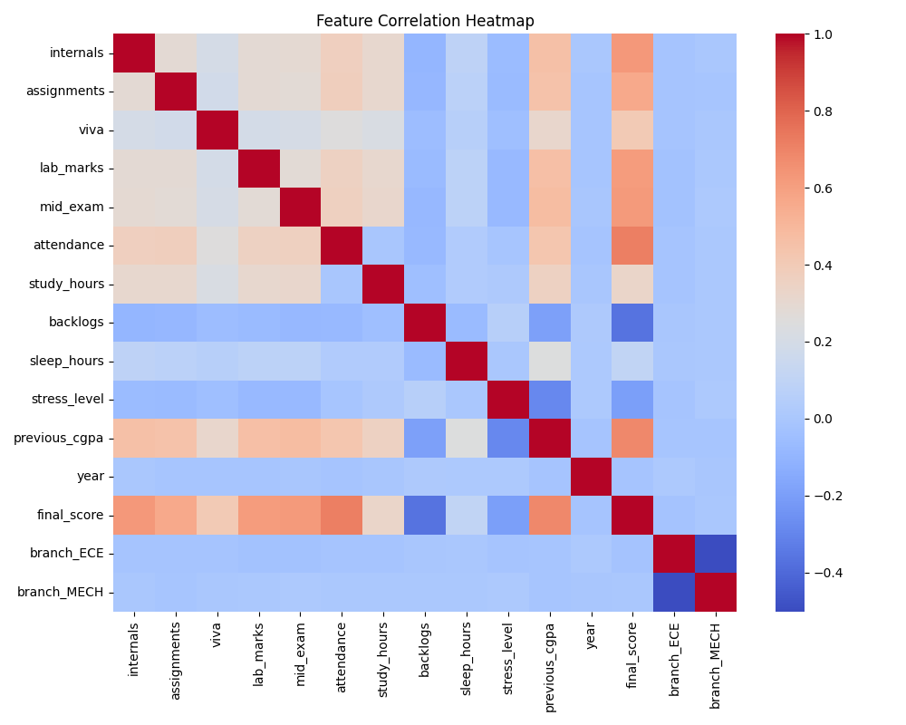
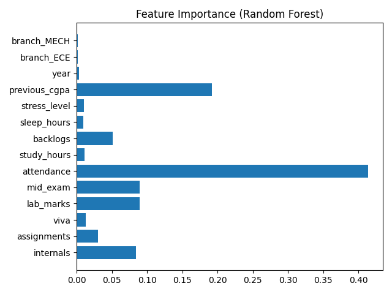

#### Prediction Accuracy
Visualizing the accuracy and residuals of our models:

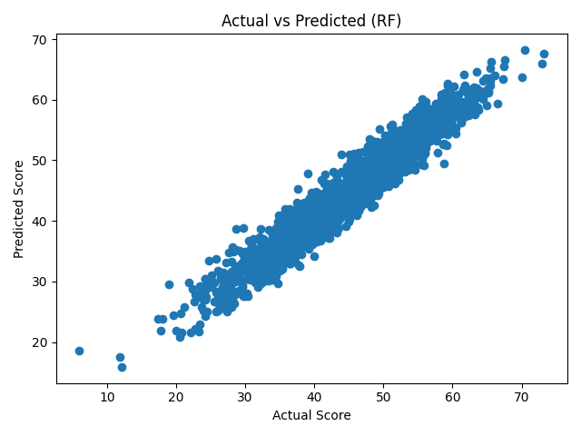
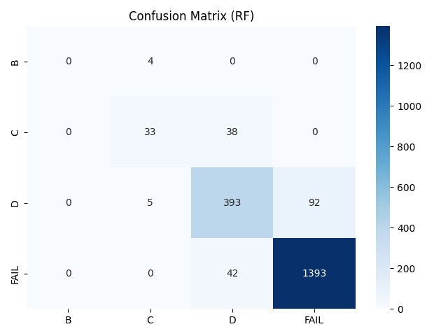

---

## 🛠️ Tech Stack

- **Frontend**: React.js, Vite, Tailwind CSS, Framer Motion, Lucide Icons.
- **Backend**: Node.js, Express.js, MongoDB, Mongoose.
- **ML Service**: Python, Flask, Pandas, Scikit-Learn, Joblib.
- **Models**: Random Forest (Classification & Regression).

---

## ⚙️ Installation & Setup

### Prerequisites
- Node.js & npm
- Python 3.10+
- MongoDB (Local or Atlas)

### 1. ML Service Setup
```bash
cd ml_service
pip install -r requirements.txt
python app.py
```
*Service will run on `http://127.0.0.1:5001`*

### 2. Backend Setup
Update `backend/.env` with your `MONGO_URI`.
```bash
cd backend
npm install
npm run dev
```
*Server will run on `http://localhost:5000`*

### 3. Frontend Setup
```bash
cd frontend
npm install
npm run dev
```
*Dashboard will be accessible at `http://localhost:5173` (or check console for port).*

---

## 📊 System Diagrams (Visual Charts)

### 1. DFD Level-0 (Context Diagram)
Describes the external entities and the high-level data flow.

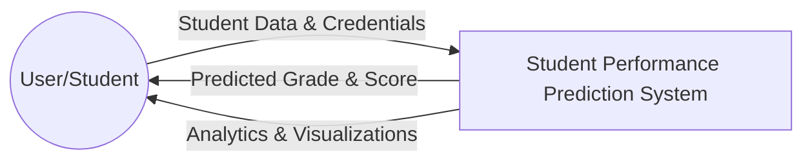

### 2. System Architecture
Visualizes the physical components and their interactions.

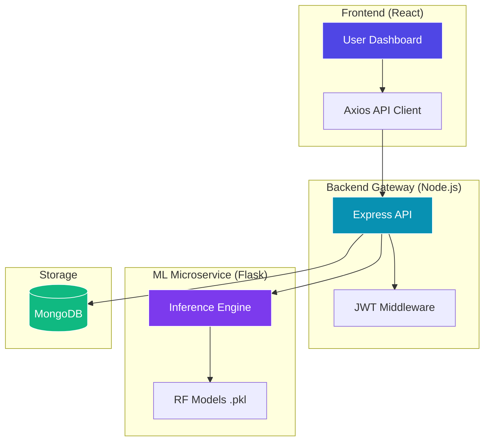

### 3. Object Diagram
Visualizes the runtime instances of objects within the system.

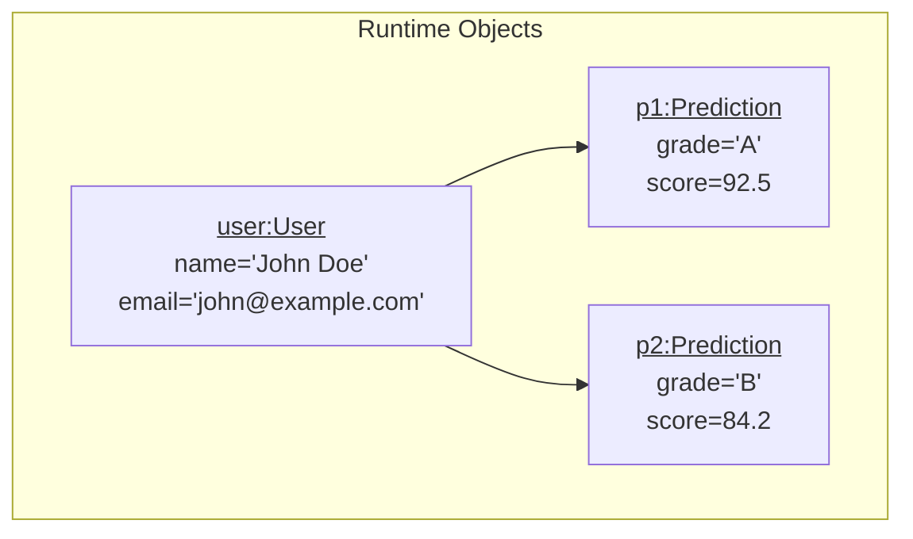

### 4. DFD Level-1 (Process Decomposition)
Breaks down the system into detailed functional processes.

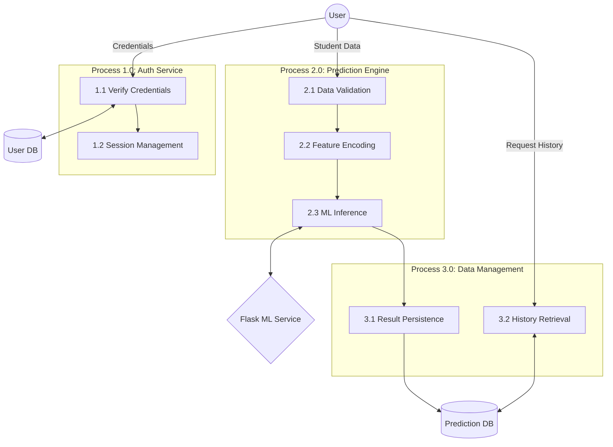

### 5. Use Case Diagram
Defines the interactions between actors and the system.

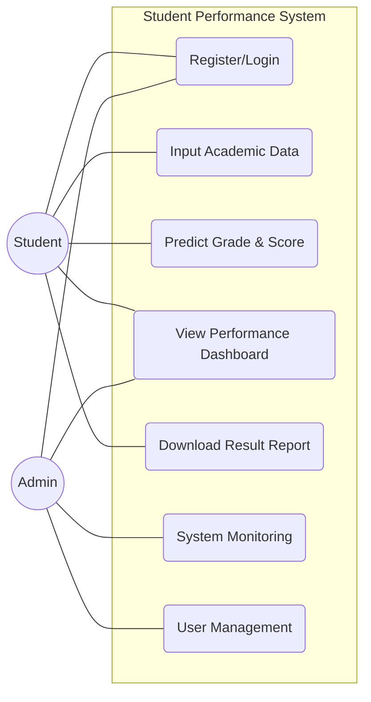

### 6. UML Class Diagram
Represents the static structure and relationships of system classes.

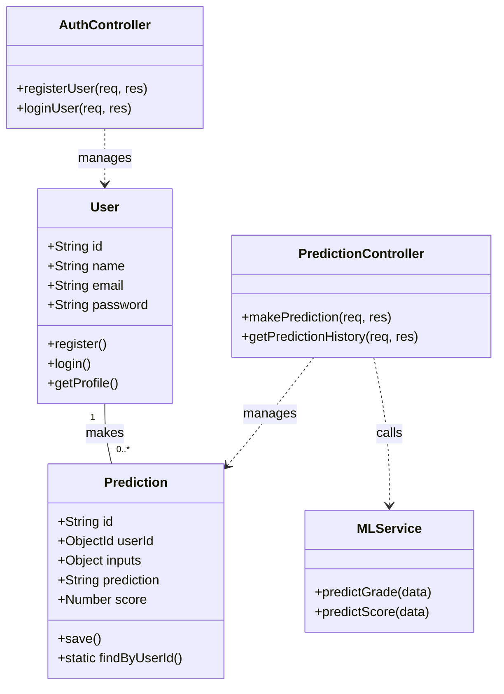

### 7. Sequence Diagram (Prediction Flow)
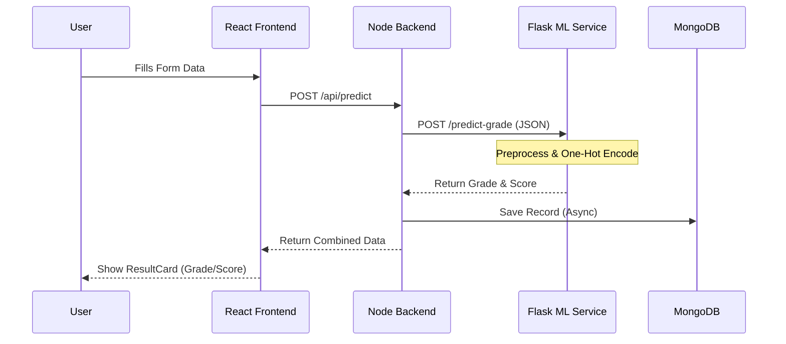

### 8. Entity Relationship Diagram (ERD)
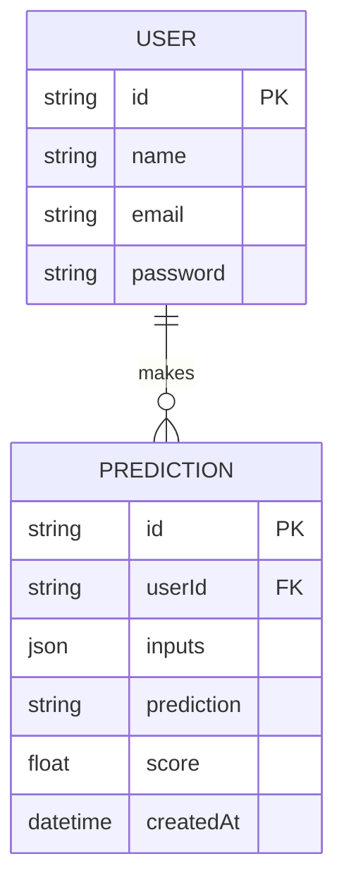

### 9. Activity Diagram (User Workflow)
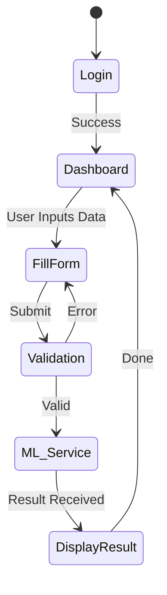

---

## 📖 Data Dictionary

Comprehensive list of data elements used in the system.

### Table: User
| Field | Type | Description |
| :--- | :--- | :--- |
| `name` | String | Full name of the student. |
| `email` | String | Unique email address used for login. |
| `password` | String | Hashed password for authentication. |
| `createdAt` | DateTime | Timestamp of account creation. |

### Table: Prediction
| Field | Type | Description |
| :--- | :--- | :--- |
| `userId` | ObjectId | Reference to the owner (User model). |
| `inputs.internals` | Number | Internal marks out of 30. |
| `inputs.assignments`| Number | Assignment marks out of 10. |
| `inputs.viva` | Number | Viva marks out of 20. |
| `inputs.lab_marks` | Number | Laboratory marks out of 30. |
| `inputs.attendance` | Number | Attendance percentage (0-100). |
| `inputs.study_hours`| Number | Hours spent studying per day. |
| `inputs.branch` | String | Student's branch (CSE, ECE, etc.). |
| `prediction` | String | Predicted letter grade (A, B, C, D, F). |
| `score` | Number | Predicted numeric score (0-100). |
| `createdAt` | DateTime | Timestamp when prediction was made. |

---

## 🎯 Evaluation & Viva Tips

### Most Important Diagrams for Evaluation
1.  **System Architecture**: Crucial to show how you integrated MERN with Python.
2.  **Sequence Diagram**: Explains the logic flow across different servers.
3.  **ER Diagram**: Shows you understand structured data storage in NoSQL.

### Viva Presentation Tips
- **Explain the "Why"**: When asked about the Python microservice, explain that Node.js cannot natively run `.pkl` models efficiently, so you used a dedicated Flask service for better performance.
- **Robustness**: Mention that you implemented error handling so the frontend works even if the database is temporarily offline.
- **Preprocessing**: Be ready to explain how you handled the **One-Hot Encoding** for the "Branch" feature in the Python script.
- **Model Choice**: Know that you used **Random Forest** because it handles non-linear academic data relationships better than simple Linear Regression.