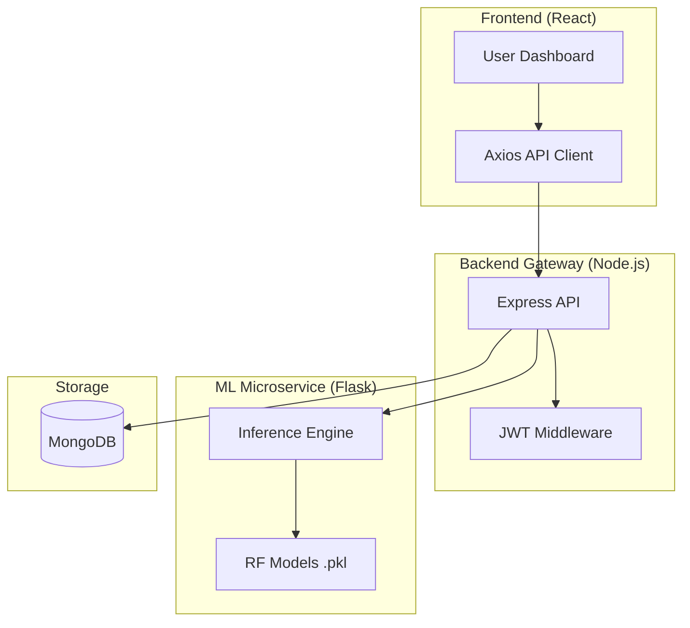
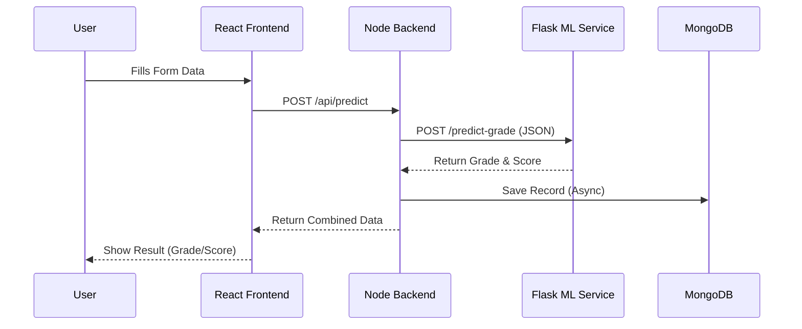
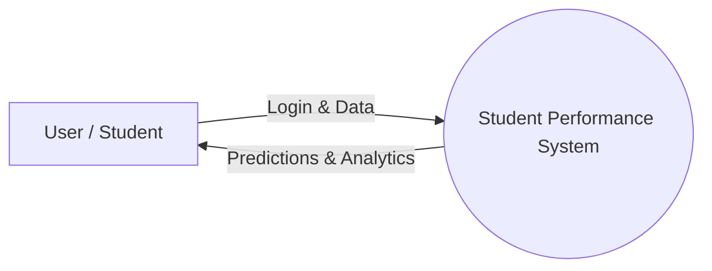

# 🎓 Student Performance Prediction System

## 📝 Project Description
The **Student Performance Prediction System** is a sophisticated full-stack application designed to forecast academic outcomes based on student data. By integrating a **MERN (MongoDB, Express, React, Node.js)** architecture with a specialized **Python Flask microservice**, the system provides high-precision predictions for student grades and numeric scores. It leverages advanced **Machine Learning** models to analyze both academic metrics and lifestyle factors, offering actionable insights through a modern, interactive dashboard.

## 📂 Project Structure
```text
SEPM_PROJECT/
├── backend/                # Node.js + Express API Gateway
│   ├── config/             # Database connection settings
│   ├── controllers/        # Business logic & Auth controllers
│   ├── models/             # Mongoose schemas (User, Prediction)
│   ├── middleware/         # JWT Authentication logic
│   └── server.js           # Server entry point
├── frontend/               # React + Vite + Tailwind CSS UI
│   ├── src/
│   │   ├── components/     # Reusable UI components
│   │   ├── pages/          # Dashboard & Login views
│   │   └── services/       # API interaction layer
├── ml_service/             # Python Flask ML Microservice
│   ├── app.py              # Flask server & Model inference
│   └── requirements.txt    # Python dependencies
└── ml_results/             # Trained Models & Visualization outputs
```

## 🚀 Features
*   **Predictive Analytics**: Forecasts letter grades (A–F) and numeric scores with high accuracy using **Random Forest** and **XGBoost**.
*   **Microservice Architecture**: Decouples ML workloads from the web server for optimal **scalability** and performance.
*   **Dynamic Dashboard**: Visualizes complex data including **Feature Importance** and **Confusion Matrices**.
*   **Secure Authentication**: Robust user management system utilizing **JWT (JSON Web Tokens)**.
*   **System Resilience**: Backend designed to handle database fluctuations gracefully, ensuring constant uptime.

## 🛠️ Tech Stack
*   **Frontend**: React.js, Vite, Tailwind CSS, Framer Motion
*   **Backend**: Node.js, Express.js, MongoDB (Mongoose)
*   **Machine Learning**: Python, Flask, Scikit-Learn, Pandas, Joblib
*   **Security**: JWT Authentication & Bcrypt password hashing

## 📊 Machine Learning Details
The core engine is trained on a robust dataset of **10,000 student records**, simulating realistic academic correlations and performance bounds.

### Model Performance
| Model | Task | Accuracy / R² Score | MAE |
|---|---|---|---|
| **XGBoost Classifier** | Grade Prediction | **88.1%** | N/A |
| **Random Forest Classifier** | Grade Prediction | 86.3% | N/A |
| **XGBoost Regressor** | Score Prediction | **0.95 (R²)** | **1.71** |
| **Random Forest Regressor** | Score Prediction | 0.92 (R²) | 2.06 |

### Visual Insights
*   **Correlation Heatmaps**: Identify key drivers of student success.
*   **Feature Importance**: Ranks factors like **attendance** and **study hours**.

## ⚙️ Setup Instructions

### 1. ML Microservice
Initialize the Python environment and start the inference engine:
```bash
cd ml_service
pip install -r requirements.txt
python app.py
```
*Service runs on http://127.0.0.1:5001*

### 2. Backend Gateway
Configure your environment variables in `backend/.env` (e.g., `MONGO_URI`) and launch the server:
```bash
cd backend
npm install
npm run dev
```
*Server runs on http://localhost:5000*

### 3. Frontend Dashboard
Install dependencies and start the development server:
```bash
cd frontend
npm install
npm run dev
```
*Dashboard accessible at http://localhost:5173*

## 🗺️ System Design & Diagrams

### 1. System Architecture


### 2. Sequence Diagram


### 3. Data Flow (Level 0)


## 📖 Data Dictionary

### 1. User Entity
| Field | Type | Description |
| :--- | :--- | :--- |
| `name` | String | Full name of the student |
| `email` | String | Unique login identifier |
| `password` | String | Hashed credential |

### 2. Prediction Inputs
| Field | Description | Range |
| :--- | :--- | :--- |
| `internals` | Internal marks | 0 - 100 |
| `attendance` | Class percentage | 0 - 100 |
| `study_hours` | Daily study time | 0 - 24 |
| `branch` | Department | String |

## 💡 Future Improvements
*   **Real-time Analytics**: Implement WebSockets for live performance tracking.
*   **Automated Retraining**: Build a pipeline for model updates as new data arrives.
*   **Mobile Application**: Develop a dedicated app using **React Native**.
*   **AI Recommendations**: Provide students with personalized study tips based on predictions.